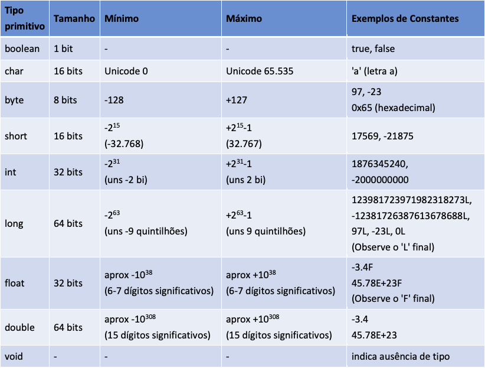

## Condicionais ternários
Uma estrutura de condicionais ternários segue a seguinte estrutura:

    condição ? expressão1 : expressão2;

- condição: Uma expressão que será avaliada como true ou false.
- expressão1: Será retornada se a condição for verdadeira (true).
- expressão2: Será retornada se a condição for falsa (false).

Exemplo:

    média = númeroDeNotas == 0 ? 0.0 : soma/númeroDeNotas;
    //Equivalente a 
    if(númeroDeNotas == 0) {
        média = 0.0;
    } else {
        média = soma/númeroDeNotas;
    }

## Tipos de dados
Os tipos de dados primitivos são: 

- Todos os tipos primitivos tem seu equivalente em objetos, por exemplo int pode ser substituído por um objeto do tipo Integer, char por objeto do tipo Character, double por Double
- Tipos primitivos e objetos são tratados de forma diferente. Uma das grandes diferenças é que conseguimos rodar métodos (funções) em objetos e nos tipos primitivos não
- Por exemplo, quando temos um objeto do tipo Double conseguimos rodar nesse objeto o método intValue():
- Double numDouble = Double.valueOf(3.45);
- numDouble.intValue();//isso vai retornar um int com valor 3