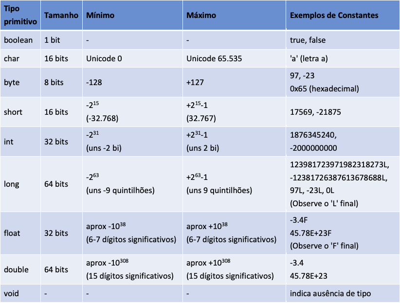

# Compilação Java
A linguagem Java é compilada e interpretada, isso permite dois principais aspéctos da linguagem:
- Portabilidade 
- Desempenho

> Linguagem compilada: Traduz o código de uma linguagem de alto nível (L1) diretamente para o código de máquina (L0), criando um executável. Isso proporciona maior desempenho, mas menor portabilidade, pois exige diferentes compilações para diferentes arquiteturas.
>
> Linguagem interpretada: Traduz o código de uma linguagem de alto nível (L1) instrução por instrução para o código de máquina (L0). Isso permite maior portabilidade, mas com menor desempenho.
> 
> Linguagem híbrida: Combina os dois métodos. No caso do Java, o código-fonte é compilado para um código intermediário independente de plataforma (bytecode) e interpretado por uma máquina virtual, podendo incluir otimizações just-in-time (JIT).

No caso do Java, sua compilação funciona da seguinte forma: o compilador do Java (javac) traduz o código para bytecode, que é executado pela JVM (Java Virtual Machine). A JVM interpreta ou compila este bytecode em tempo de execução para código nativo da máquina onde o programa está rodando.

## Fluxo de compilação
Código Java (.java) → Compilador Java (javac) → Bytecode (.class)

## Compilando e executando
No diretório exato onde o arquivo está localizado, abra o terminal e siga os passos:
- Compilar o programa: 
  - <code>javac nomeDoPrograma.java</code>
    - O compilador gerará um arquivo nomeDoPrograma.class. Este arquivo contém o bytecode, um formato binário que não pode ser lido diretamente.
    
- Executar o programa: 
  - <code>$ java nomeDoPrograma</code>
    - Se o programa pertencer a um pacote:
      - Certifique-se de que o arquivo .java está no diretório correspondente ao pacote declarado.
        Exemplo:
        Se o código contém package p2.exemplos;, o arquivo deve estar no caminho p2/exemplos/nomeDoPrograma.java.
      - Para Compilar:
          - <code>javac p2/exemplos/nomeDoPrograma.java
            </code>
      - Para executar: 
        - <code>java -cp . p2.exemplos.nomeDoPrograma</code>
          - -cp . indica que o diretório atual (.) é o classpath.
            O nome do programa deve incluir o pacote completo (exemplo: p2.exemplos.nomeDoPrograma).

## Resumo dos Aspectos Técnicos
- Compilação: Código-fonte Java (.java) → Bytecode (.class).
- Execução: Bytecode é interpretado ou compilado para código de máquina pela JVM.
- Portabilidade: O bytecode pode ser executado em qualquer sistema que possua uma JVM compatível.