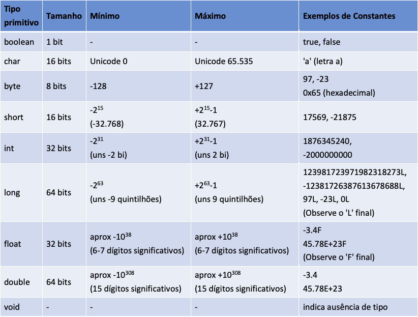

## Condicionais 
Condicionais seguirá a seguinte estrutura:

    if (nome == escolha) {
        nome == "Rafael";

    } else if (nome != escolha) {
        nome == escolha;

    else {
        System.out.print("Inapropriado);
    }

## ternários
Uma estrutura de condicionais ternários segue a seguinte estrutura:

    condição ? expressão1 : expressão2;

- condição: Uma expressão que será avaliada como true ou false.
- expressão1: Será retornada se a condição for verdadeira (true).
- expressão2: Será retornada se a condição for falsa (false).

Exemplo:

    média = númeroDeNotas == 0 ? 0.0 : soma/númeroDeNotas;
    //Equivalente a 
    if(númeroDeNotas == 0) {
        média = 0.0;
    } else {
        média = soma/númeroDeNotas;
    }

## Tipos de dados
Os tipos de dados primitivos são: 

- Todos os tipos primitivos tem seu equivalente em objetos, por exemplo int pode ser substituído por um objeto do tipo Integer, char por objeto do tipo Character, double por Double
- Tipos primitivos e objetos são tratados de forma diferente. Uma das grandes diferenças é que conseguimos rodar métodos (funções) em objetos e nos tipos primitivos não
- Por exemplo, quando temos um objeto do tipo Double conseguimos rodar nesse objeto o método intValue():
- Double numDouble = Double.valueOf(3.45);
- numDouble.intValue();//isso vai retornar um int com valor 3

Observe um pouco do tipo Integer

## Integer

    int minimo = Integer.MAX_VALUE, maximo = Integer.MIN_VALUE, entrada;

Além da definição do tipo de dados, a linha também apresenta um outro tipo de dado, o <code>integer</code>, tipo primitivo do int. Útil em várias situações, por exemplo:
- Quando é necessário trabalhar com estruturas de dados que aceitam apenas objetos, como as classes da API de coleções do Java (ex.: ArrayList ou HashMap).
- Quando métodos exigem objetos como parâmetros em vez de tipos primitivos.
- Para manipular valores inteiros com métodos adicionais oferecidos pela classe Integer.

Principais métodos da classe <code>Integer</code>
- String para inteiro
    - <code>Integer.parseInt(String s)</code>: Converte uma string em um valor inteiro.

            int numero = Integer.parseInt("123");
            System.out.println(numero); // Saída: 123

- Inteiro para string
    - <code>Integer.toString(int i)</code>: Converte um número inteiro em uma string.

            String texto = Integer.toString(123);
            System.out.println(texto); // Saída: "123"

- Valor máximo e mínimo
    - <code>Integer.MAX_VALUE</code>: Valor máximo que um int pode armazenar (2³¹ - 1).
    - <code>Integer.MIN_VALUE</code>: Valor mínimo que um int pode armazenar (-2³¹).

          System.out.println(Integer.MAX_VALUE); // Saída: 2147483647
          System.out.println(Integer.MIN_VALUE); // Saída: -2147483648

- Compara dois valores
    - <code>Integer.compare(int x, int y)</code>: Compara dois valores inteiros.
        - Retorna:
            - 0 se x == y
            - Um número negativo se x < y
            - Um número positivo se x > y

                    System.out.println(Integer.compare(10, 20)); // Saída: -1

- Conversão para outras bases numéricas:
    - <code>Integer.toBinaryString(int i)</code>: Retorna a representação binária.
    - <code>Integer.toHexString(int i)</code>: Retorna a representação hexadecimal.

          System.out.println(Integer.toBinaryString(10)); // Saída: "1010"
          System.out.println(Integer.toHexString(255));  // Saída: "ff"